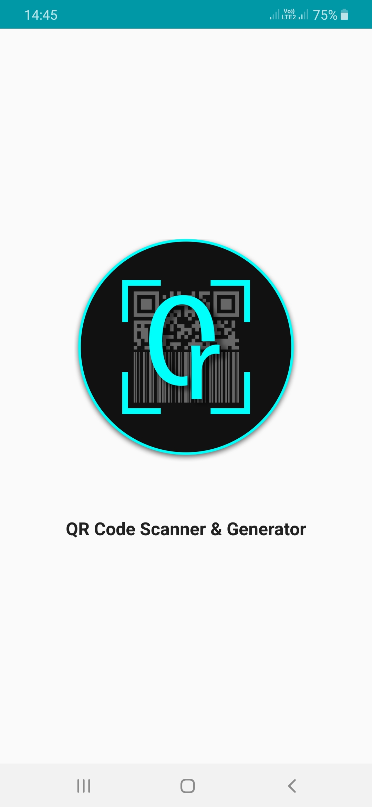
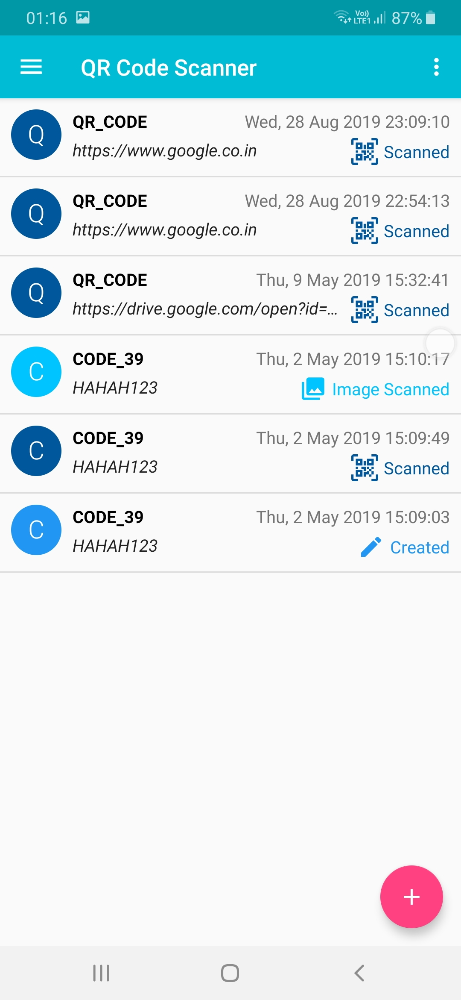
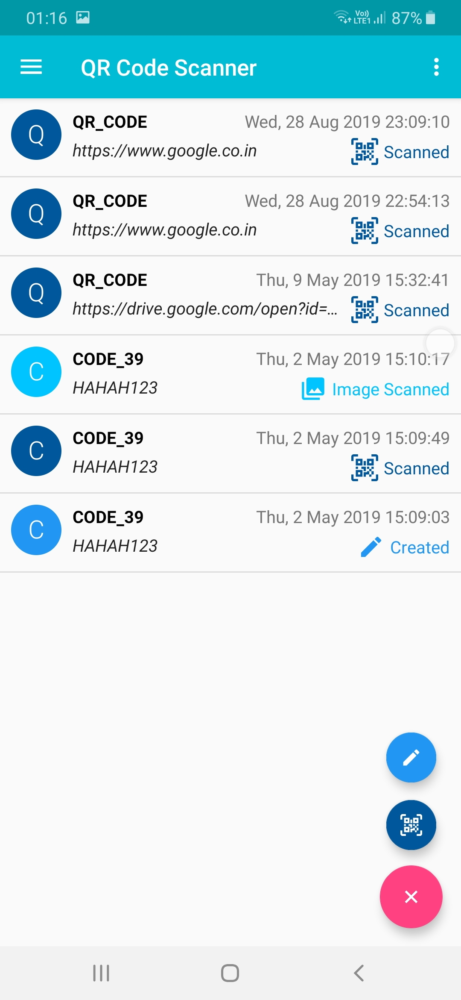
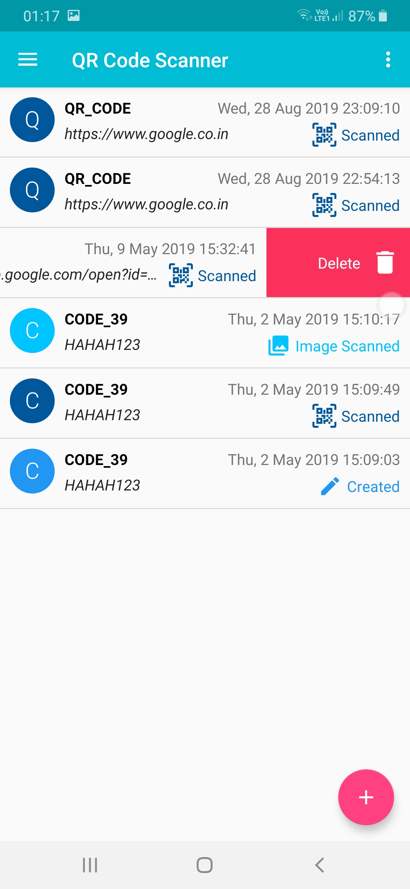
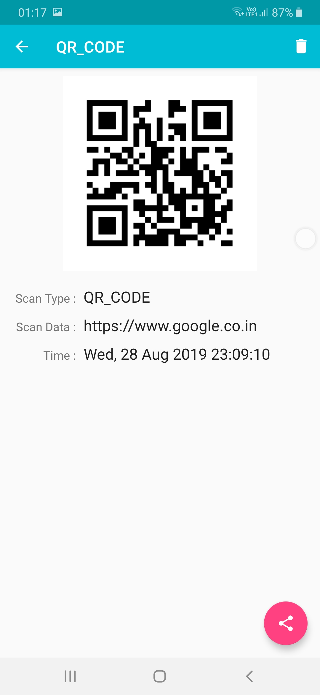
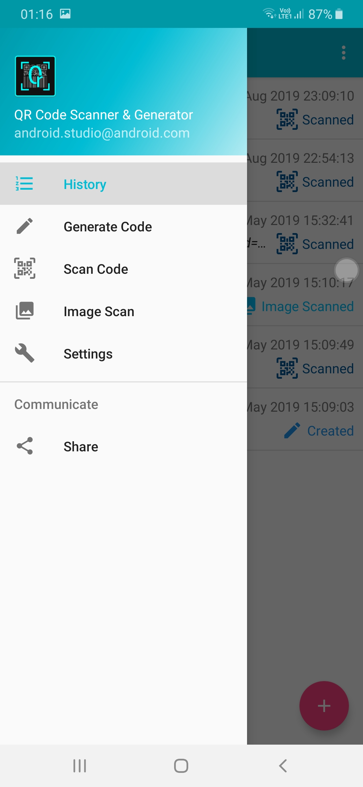
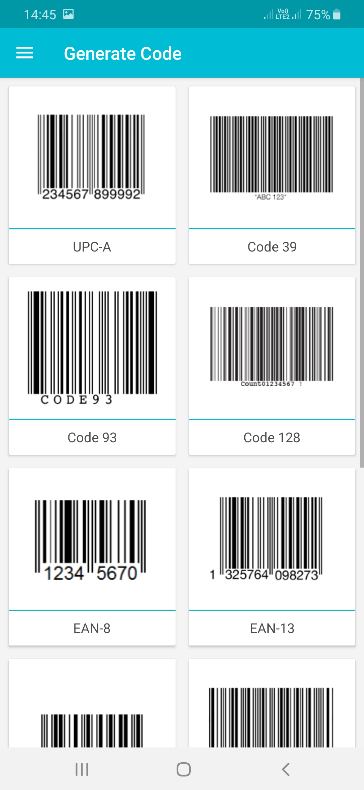
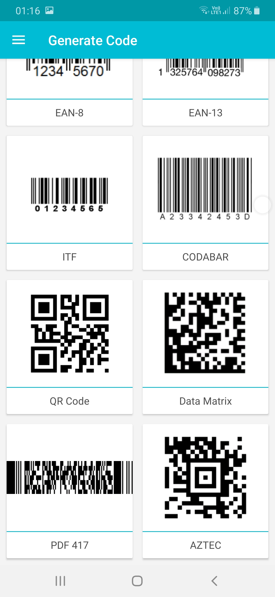
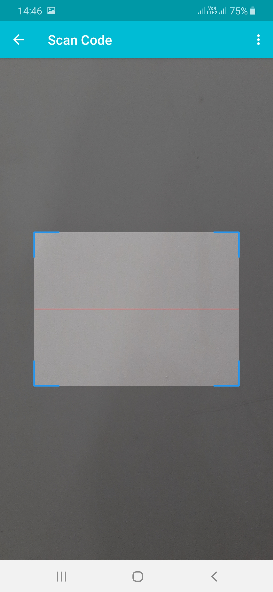
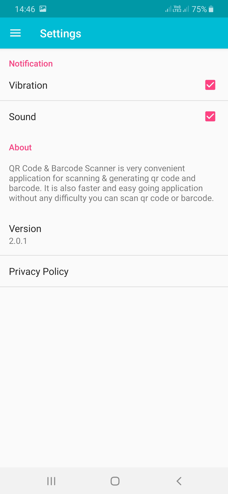

#  QR Code Scanner & Generator 

**QR Code Scanner & Generator** is a convenient application for scanning and generating QR codes and barcodes. It's a fast and easy-to-use tool designed to make your experience seamless. Whether you need to scan or create codes, this app covers you! 🎯📊

## 🚀 Features

- **Fast & Easy Scanning**: Quickly scan QR codes and barcodes without any difficulty. ⚡🔍
- **Flashlight Function**: Use the built-in flashlight for scanning in low-light conditions. 💡
- **Auto Focus**: Automatically adjusts focus for clear and readable scans. 📸🔭
- **Generate Codes**: Create new QR and barcodes with sample data. 🆕
- **High-Resolution Sharing**: Share QR code and barcode images in high resolution. 📤📈
- **Enhanced Device Features**: Leverage additional Android device features for an improved experience. 📱✨

## 🛠️ Built With

- **Native Android**: Built using Java and Kotlin for a seamless and efficient user experience. 🤖

## 📚 How to Use

1. **Scan QR Codes & Barcodes**: Point your camera at a QR code or barcode to scan it. 📷
2. **Generate New Codes**: Create new QR codes and barcodes with sample data. 🆕
3. **Use Flashlight**: Toggle the flashlight feature for better visibility in low-light conditions. 💡
4. **Auto Focus**: Ensure your device's auto-focus feature is enabled for clear scans. 🔍
5. **Share Images**: Easily share high-resolution QR codes and barcode images. 📤

## 🎉 Top Features

- **Fast & Efficient** ⚡
- **User-Friendly Interface** 👍
- **Flashlight Function** 💡
- **Auto Focus Adjustment** 🔭
- **Generate & Share Codes** 🆗
- **High-Resolution Sharing** 📈

## 🖼️ Screenshots

Check out some of the screenshots from the app: 📸

  
  
  
  
  
  
  
  
  
  
  

---
